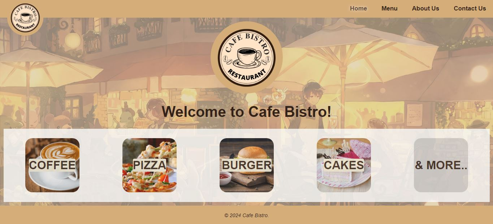

# Restaurant Website

A static Restaurant Website built using HTML and CSS.

### Authors

- [@ChaitanyaShah26](https://github.com/ChaitanyaShah26)

## Overview

This repository contains the source code for a static restaurant website. This project showcases the use of HTML &amp; CSS for building the website. It is a user-friendly website with major pages like Home, Menu, About and Contact.

- [Features](#features)
- [Structure](#structure)
- [Technologies Used](#technologies-used)
- [Installation](#installation)
- [Deployment](#deployment)
- [Screenshots](#screenshots)
- [License](#license)

## Features

- __Home:__ Welcome page to the Restaurant site.
- __Menu:__ Menu of the restaurant, showing a list of different items available.
- __About:__ Information about the Restaurant.
- __Contact:__ Contact details, address and reach out form to get in touch with the restaurant.

## Structure

The project consists of the following files:
1. **[index.html](https://github.com/DJS-INFOMATRIX/Web-App-Development/blob/main/Restaurant_Website/RestaurantWebsite_ChaitanyaShah/index.html) :** Essential HTML file for the website project. It represents the _Home_ page of the website.
2. **[menu.html](https://github.com/DJS-INFOMATRIX/Web-App-Development/blob/main/Restaurant_Website/RestaurantWebsite_ChaitanyaShah/menu.html) :** List of dishes for the _Menu_ page.
3. **[about.html](https://github.com/DJS-INFOMATRIX/Web-App-Development/blob/main/Restaurant_Website/RestaurantWebsite_ChaitanyaShah/about.html) :** Content for the _About_ page giving information of the restaurant.
4. **[contact.html](https://github.com/DJS-INFOMATRIX/Web-App-Development/blob/main/Restaurant_Website/RestaurantWebsite_ChaitanyaShah/contact.html) :** Contact number, address and Form for _Contact_ page.
5. **[style.css](https://github.com/DJS-INFOMATRIX/Web-App-Development/blob/main/Restaurant_Website/RestaurantWebsite_ChaitanyaShah/style.css) :** Stylesheet for representation of all the above .html files.
6. **[menu images](https://github.com/DJS-INFOMATRIX/Web-App-Development/tree/main/Restaurant_Website/RestaurantWebsite_ChaitanyaShah/menu%20images) :** The menu images folder consists of all the menu images used in the menu page of website.

## Technologies Used

- **HTML:** For the structure of the website.
- **CSS:** For styling and layout.

## Installation

Kindly follow the below steps to install/run my project on your local device:

1. **Clone the repository:**
   Clone the repository on your local device.
2. **Navigate to the project directory:**
   Navigate to the directory `RestaurantWebsite_ChaitanyaShah`.
3. **Open `index.html` in your preferred web browser.**

## Deployment

The project is deployed using **GitHub Pages** on the below link.
```
https://chaitanyashah26.github.io/Restaurant-Website/
```
[Click Here](https://chaitanyashah26.github.io/Restaurant-Website/) to open the website.

## Screenshots

Below is the preview of the Restaurant Website.


## License

[MIT](https://github.com/DJS-INFOMATRIX/Web-App-Development/blob/main/Restaurant_Website/RestaurantWebsite_ChaitanyaShah/LICENSE)
